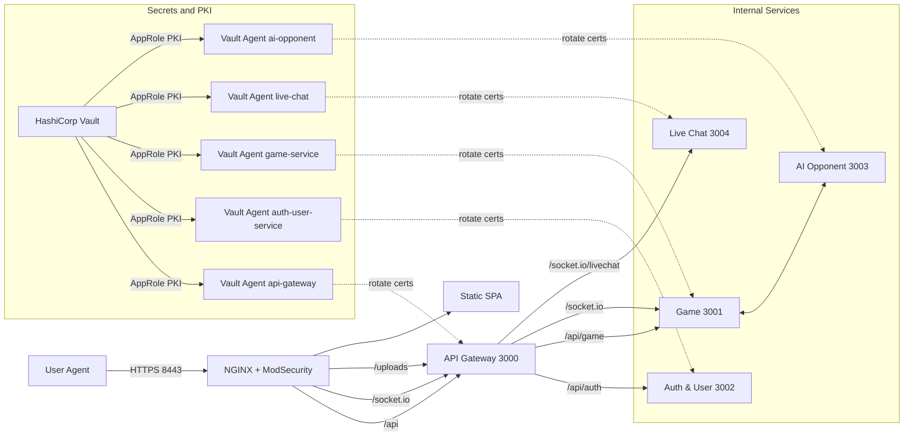

# ft_transcendence

A secure, containerized, real‑time Pong platform with account management, OAuth 42 login, optional TOTP 2FA, live chat, tournaments, AI opponent and a hardened edge (Nginx + ModSecurity). Internal gateway‑to‑service traffic uses HTTPS with Vault‑issued server certificates; mTLS is used only for calls to Vault. The SPA frontend is built with Vite and served by the Nginx edge (protected by ModSecurity WAF); Fastify services handle API, game and chat via HTTP and WebSockets.

## Overview
- SPA frontend served by the Nginx edge (protected by ModSecurity WAF) on `:8443`.
- API Gateway (Fastify) terminates client APIs and proxies to internal services.
- Services:
  - Auth & User Service (Fastify, SQLite): signup/login, OAuth 42, TOTP 2FA, profile, avatars, friends, stats.
  - Game Service (Fastify + Socket.IO): matchmaking, rooms, tournaments.
  - Live Chat Service (Fastify + Socket.IO): room chat, notifications, stats hooks.
  - AI Opponent Service: headless Socket.IO client powering AI games.
  - Vault (dev single node or prod 3‑node Raft): PKI, AppRole + Vault Agents for cert issuance/rotation.
- Monorepo with npm workspaces; Docker Compose orchestrates the stack.

## Architecture
High‑level flow
- Browser → WAF (HTTPS 8443, WAF rules + rate limiting) → API Gateway → internal services (HTTPS).
- Static SPA and uploaded avatars are served by the Nginx edge; WAF inspects/protects API paths (WebSockets bypass WAF body parsing).
- Game service endpoints via gateway:
  - HTTP API at `/api/game/*`
  - WebSocket at `/socket.io`
- Live Chat WebSocket via gateway: `/socket.io/livechat`
- Auth: JWT. API Gateway validates tokens and injects `x-user-id` and `x-user-nickname` for internal calls.
- Secrets/TLS: Vault Agents mint/rotate short‑lived certs; services hot‑reload TLS on `SIGHUP`.

Main services and ports
- WAF (Nginx + ModSecurity): 8443
- API Gateway (Fastify): 3000
- Game Service: 3001
- Auth & User Service: 3002
- AI Opponent Service: 3003
- Live Chat Service: 3004
- Vault (dev UI): 8200; prod cluster nodes bound internally (see compose comments)

Key paths
- Compose: `ft_transcendence/docker-compose.yml`
- Make targets: `ft_transcendence/Makefile`
- Frontend sources: `ft_transcendence/frontend-src`
- WAF assets target: `ft_transcendence/services/web-application-firewall/html`
- Services (API/Game/Auth/Chat/AI): `ft_transcendence/services/*`

### Architecture Diagram

## Features
- OAuth 42 login flow with state tracking and redirect handling.
- Email/password auth with bcrypt and JWT; optional TOTP 2FA (enable/disable and 2FA login).
- Profile management: nickname, avatar upload (with size limits), preset avatars.
- Friends and friend requests; user profiles by id.
- Game rooms, tournaments, match history and per‑user statistics.
- Live chat with Socket.IO; tournament and profile update notifications.
- AI opponent on demand per room, with lifecycle and cleanup.
- WAF protections and rate limits on sensitive routes; SPA fallback.
- mTLS between internal services; automated certificate rotation via Vault Agents.

## Prerequisites
- Docker and Docker Compose v2
- Node.js 20+ and npm
- OpenSSL (for local cert utilities)
- Optional: Rust toolchain if you want to run the TUI CLI (`make cli`)

## Quick Start (Docker, prod‑like)
These targets seed Vault configuration, build the SPA, and start all services.

1) Set hosts entry for local domain
- The stack uses `ft-transcendence.at` by default.
- Add a hosts entry pointing to your machine’s LAN IP:
  - Detects IP automatically: `make hosts-add`
  - Remove later with: `make hosts-remove`

2) Initialize environment
- `make setup-env` populates `.env` with your `HOST_UID`/`HOST_GID` and preserves existing values.
- Edit `ft_transcendence/.env` to set real OAuth credentials and domain:
  - `OAUTH_CLIENT_ID_42`, `OAUTH_CLIENT_SECRET_42` (from 42 Intra)
  - `OAUTH_REDIRECT_URL` (e.g. `https://ft-transcendence.at:8443`)

3) Build and run
- Full bring‑up (Vault + services + agents): `make prod`
- Rebuild services only: `make re-services`
- Stop stack: `make down`

4) Open the app
- https://ft-transcendence.at:8443

Cleanup helpers
- Remove volumes and networks: `make clean`
- Remove only project volumes: `make destroy-docker-volumes`
- Remove built images: `make destroy-service-images`

## Developer Workflow (local)
Run everything from sources with hot reload for services and Vite for the SPA.

1) Install deps and set env
- `make dep-check` (verifies tools and runs `npm ci`/`npm install` as needed)
- `make setup-env` (updates `.env` with your UID/GID)

2) Start Vault (dev profile)
- Seeds config and dev certs, runs single‑node Vault with UI: `make start-vault-dev`
- Reset dev Vault: `make vault-dev-re`

3) Start all dev servers
- `npm run dev` runs:
  - Auth, Game, API Gateway, Live Chat, AI Opponent (Fastify + tsx watch)
  - Frontend Vite dev server on `https://localhost:5173`
- The SPA proxies `/api`, `/socket.io`, `/uploads` to the gateway at `https://localhost:3000`.

4) Build frontend (when needed)
- `npm run build:frontend` outputs to `services/web-application-firewall/html`.

Notes
- Services auto‑enable HTTPS if `server.key/server.crt/ca.crt` exist under their `certs` dir; otherwise they run without HTTPS in development.
- The Gateway also serves `/uploads/` statically, and the Nginx edge exposes `/uploads/avatars/` to the browser.

## Configuration
Environment (`ft_transcendence/.env`)
- Core runtime
  - `NODE_ENV`, `LOG_LEVEL`
  - `FRONTEND_URL` (for CORS in game/chat services)
- OAuth 42
  - `OAUTH_CLIENT_ID_42`, `OAUTH_CLIENT_SECRET_42`, `OAUTH_REDIRECT_URL`
- Upstreams (gateway and services)
  - `API_GATEWAY_UPSTREAM`, `GAME_SERVICE_UPSTREAM`, `AUTH_USER_SERVICE_UPSTREAM`, `LIVE_CHAT_UPSTREAM`, `AI_OPPONENT_SERVICE_UPSTREAM`
- Vault and WAF build args
  - `VAULT_ADDR`, `NGINX_VERSION`, `MODSEC_VERSION`, `LMDB_VERSION`, `MODSEC_RULE_ENGINE`

Ports and endpoints
- App: `https://ft-transcendence.at:8443`
- Gateway health: `https://localhost:3000/api/verify`
- Service health (examples):
  - Auth: `https://localhost:3002/health`
  - Live Chat stats: `https://localhost:3004/api/health`
  - AI stats: `https://localhost:3003/api/ai/stats`

## API Surface (selected)
Auth & account
- `POST /api/signup`
- `POST /api/login`
- `GET  /api/auth/42` and `GET /api/auth/42/callback`
- `POST /api/auth/2fa/{enable|disable|login}`
- `GET  /api/account`
- `POST /api/account/update`
- `POST /api/account/delete`

Profile & users
- `GET  /api/profile`
- `PUT  /api/profile`
- `POST /api/profile/avatar/upload` (multipart, ~5MB limit)
- `DELETE /api/profile/avatar`
- `GET  /api/profile/avatars` (preset list)
- `GET  /api/user/:id`, `GET /api/users/:id`

Friends & stats
- `GET  /api/friends`
- `DELETE /api/friends/:friendId`
- `GET  /api/friends/requests`
- `GET  /api/my-statistics`
- `GET  /api/my-matches?limit=50`

Game & chat (via gateway)
- Game HTTP API: `/api/game/*`
- Game WebSocket: `/socket.io`
- Live Chat WebSocket: `/socket.io/livechat`

Authentication
- Bearer JWT in `Authorization` header for HTTP.
- For WebSockets, token via query string is accepted; the gateway validates and forwards user headers.

## Security Model
- Edge hardening with Nginx + ModSecurity, selective WAF disablement for WebSockets, and rate limiting
  on login and API paths.
- Internal HTTPS between the API Gateway and services using Vault‑issued server certificates. mTLS is
  used only for Vault API calls (Vault Agent / AppRole).
- Fast in‑process TLS reload without full restarts via a custom Fastify plugin.
- Uploaded files constrained and processed (avatars via `sharp`) and served from controlled paths.

## CLI Client
- Location: `ft_transcendence/cli`
- Purpose: Terminal UI to login (local or 42 OAuth), join/create games, or play single player vs. AI.

Run options
- Local (recommended): `make cli` (equivalent to `cargo run --release --manifest-path cli/Cargo.toml`)
- Docker: `make cli-docker` (uses compose `cli-client`, `network_mode: host`)

Usage flow
- Host selection: enter `localhost` (dev) or `ft-transcendence.at` (prod). Defaults follow build mode.
- Login methods:
  - Local Login: email/password, optional TOTP if enabled on the account.
  - Remote Login through 42: opens your default browser, completes OAuth, and returns the token to the CLI via a temporary localhost callback.
- After auth: choose Single Player, Create Room, or Join Room.

Controls
- Menus: Up/Down/Enter, Tab to toggle; Esc to go back or exit.
- In game: Up/Down to move, `p` to pause, Esc to exit to menu.

Notes
- The CLI accepts self‑signed certificates in dev to ease local testing.
- For OAuth, ensure a desktop browser is available on the same machine.

## Troubleshooting
- OAuth 42 disabled: if `OAUTH_CLIENT_ID_42`/`OAUTH_CLIENT_SECRET_42` are placeholders,
  OAuth endpoints return `503` until set.
- Certs missing: services log a warning and start without HTTPS in dev; the gateway and Vite dev server
  are already configured with relaxed TLS for local use.
- Reset everything: `make clean` removes networks and volumes; `make re` fully rebuilds.

## Contributing
- Keep changes focused and small; PRs should include a summary, verification steps and any relevant 42 subject references.
- Do not commit real credentials. `.env` is local only.

## License
This project is for 42 school educational purposes. If you plan to publish externally, add a license
file and update this section accordingly.

## Verification Steps
- Pre-checks
  - `docker --version`, `docker compose version`, `node -v` (20+) and `openssl version` are available.
  - `make dep-check` succeeds and installs npm workspaces.
- Dev mode
  - `make start-vault-dev` completes; Vault dev UI reachable at https://localhost:8200 (self-signed).
  - `npm run dev` starts 6 processes; Vite at https://localhost:5173 renders the SPA.
  - note that if certs run out of date, vault has to be rebuild in dev mode `make vault-dev-re`
- Prod-like (Docker)
  - configure `.env` OAuth values and `OAUTH_REDIRECT_URL`.
  - `make` finishes; the Nginx edge (WAF‑enabled) serves the SPA at https://ft-transcendence.at:8443.
  - Try OAuth 42: `GET /api/auth/42` redirects to 42; callback handled at `<OAUTH_REDIRECT_URL>/oAuthCallback`.
  - Upload avatar: `POST /api/profile/avatar/upload` (multipart, ≤ 5MB) then access via `/uploads/avatars/...`.
  - Verify rate limits: repeated `POST /api/login` eventually hits WAF limit rules.
